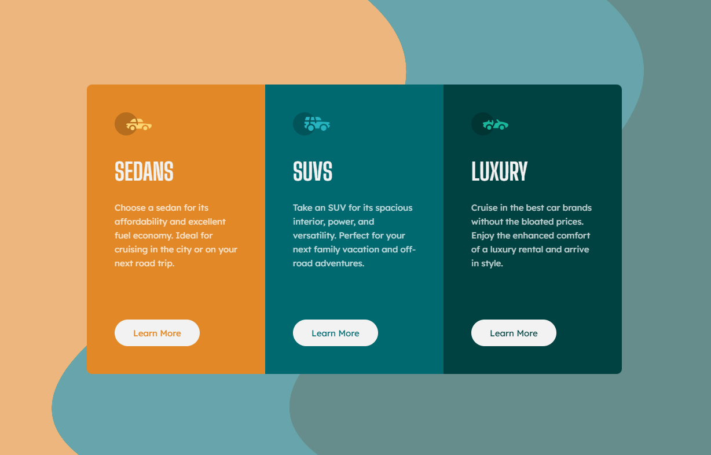

3-Column preview card (HTML, SCSS, JS)
# Frontend Mentor - 3-column preview card component solution

This is a solution to the [3-column preview card component challenge on Frontend Mentor](https://www.frontendmentor.io/challenges/3column-preview-card-component-pH92eAR2-). 
Frontend Mentor challenges help you improve your coding skills by building realistic projects. 

## Table of contents

- [Overview](#overview)
  - [The challenge](#the-challenge)
  - [Screenshot](#screenshot)
  - [Links](#links)
- [My process](#my-process)
  - [Built with](#built-with)
  - [What I learned](#what-i-learned)
  - [Continued development](#continued-development)
  - [Useful resources](#useful-resources)
- [Author](#author)

## Overview

### The challenge

Users should be able to:

- View the optimal layout depending on their device's screen size
- See hover states for interactive elements

Additional Features!
- When you click the "Learn More" button, the flip side of the card opens up, revealing the "Rent Now" button.
- Additionally, when you open a new card, the previously opened card will automatically collapse. This keeps things neat and tidy! 😊✨

### Screenshot

### Links

- Solution URL: [Solution URL here](https://www.frontendmentor.io/solutions/responsive-preview-card-component-js-html-scss-kX4rQo2xkE)
- Live Site URL: [Live site URL here](https://grimm-n.github.io/3-column-preview-card-component/)

## My process

### Built with

- Semantic HTML5 markup
- SCSS 
- Flexbox
- CSS Grid
- JS

### What I learned

I'm enhancing my skills in animation, and it really excites me! I love interactive designs that bring a site to life. 🎨✨

### Continued development

My goal remains the same: to learn how to create perfectly mobile-adapted websites. I'm dedicated to mastering this skill.

### Useful resources

- [Freepick](https://www.freepik.com/) - I downloaded the backgroud image from this site.
- [A (more) Modern CSS Reset](https://piccalil.li/blog/a-more-modern-css-reset/) - Thanks again to Andy Bell for his wonderful cheat sheet! I'm using it, adapting it to my needs, and I highly recommend it to everyone.

## Author

- LinkedIn - [Natali Grimm](https://www.linkedin.com/in/grimm-n/)
- Frontend Mentor - [@Grimm-N](https://www.frontendmentor.io/profile/Grimm-N)
- Twitter - [@Grimm__N](https://x.com/Grimm__N)
